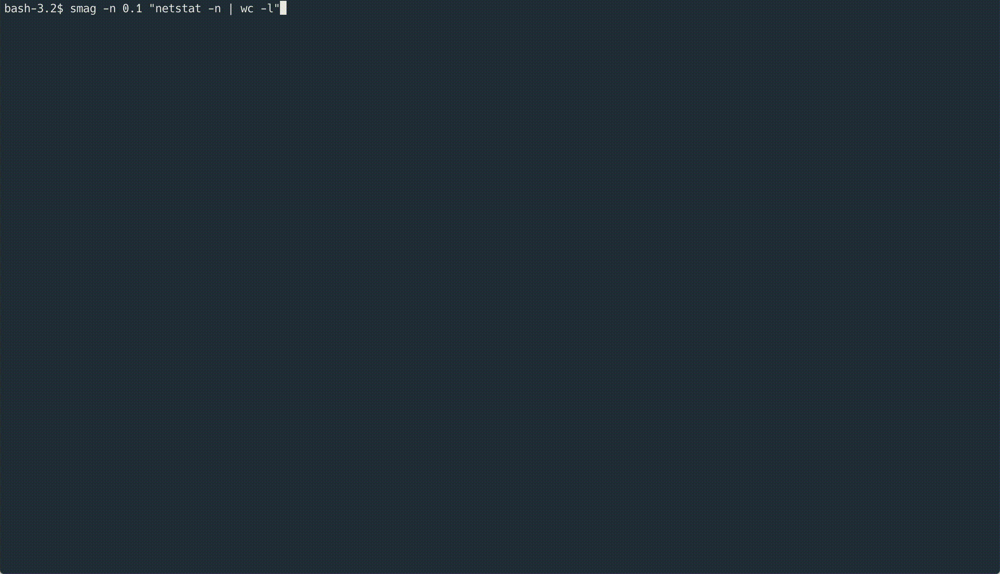

# smag - show me a graph!

Easily create graphs from cli commands and view them in the terminal. Like the `watch` command but with a graph of the output.

**smag was inspired and based on code from the wonderful [gping](https://github.com/orf/gping) tool by Tom Forbes**



Table of Contents
=================

   * [Install :cd:](#install-cd)
   * [Usage ](#usage)

# Install :cd:

## Install from source
```bash
git clone https://github.com/aantn/smag.git
cargo install --path .
```
## Install from binaries
Binaries for Mac, Windows, and Linux are available under Releases.

# Usage

Just run `smag [shell_cmd]` or `smag [cmd1] [cmd2]` if you want to graph multiple commands at once.
You can control how often the graph updates with the `-n` flag. You can also graph a derivative of the command's output using `-d`.

`smag` can graph any command which outputs an integer or float. Any whitespace before/after the number is trimmed automatically.

Pull requests for more features or fixes are welcome.

## Examples
* Graph number of processes: `smag "ps aux | wc -l"`
* Graph number of bash processes and ssh processes as two separate lines: `smag "ps aux | grep ssh | wc -l" "ps aux | grep bash | wc -l"`

## Full Usage

```bash
$ smag --help                                                                                                           ✔  2355  17:59:43
smag 0.5.0
Show Me A Graph - Like the `watch` command but with a graph of previous values.

USAGE:
    smag [FLAGS] [OPTIONS] <cmds>...

FLAGS:
    -d, --diff       Graph the diff of subsequent command outputs
        --help       Prints help information
    -V, --version    Prints version information

OPTIONS:
    -h, --history <buffer-size>          Specify number of points to 'remember' and graph at once for each commands
                                         [default: 100]
    -n, --interval <polling-interval>    Specify update interval in seconds. [default: 1.0]

ARGS:
    <cmds>...    Command(s) to run
```
